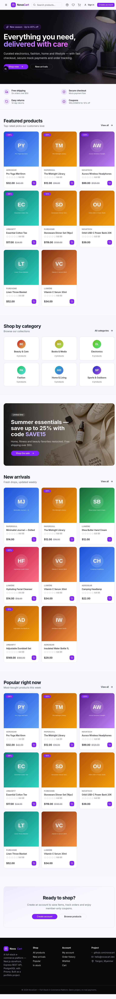
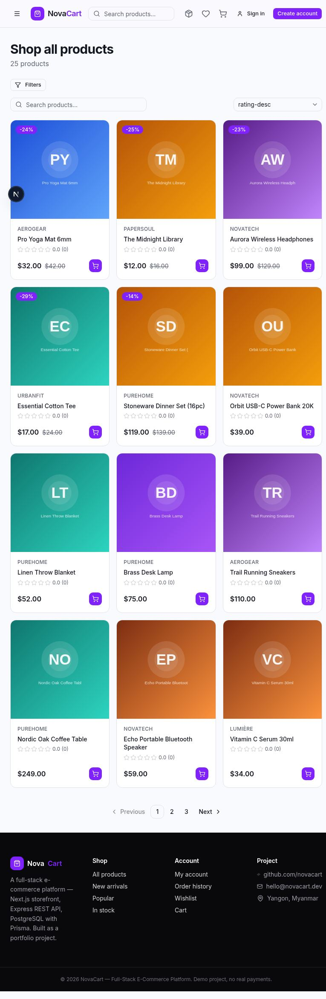
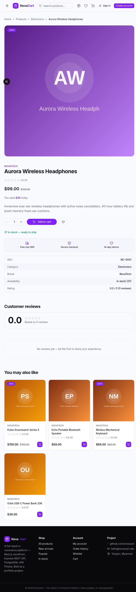
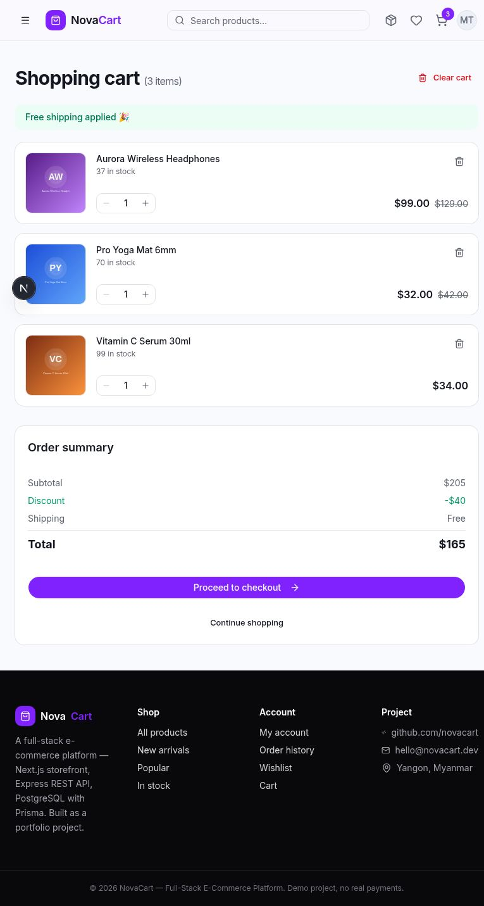
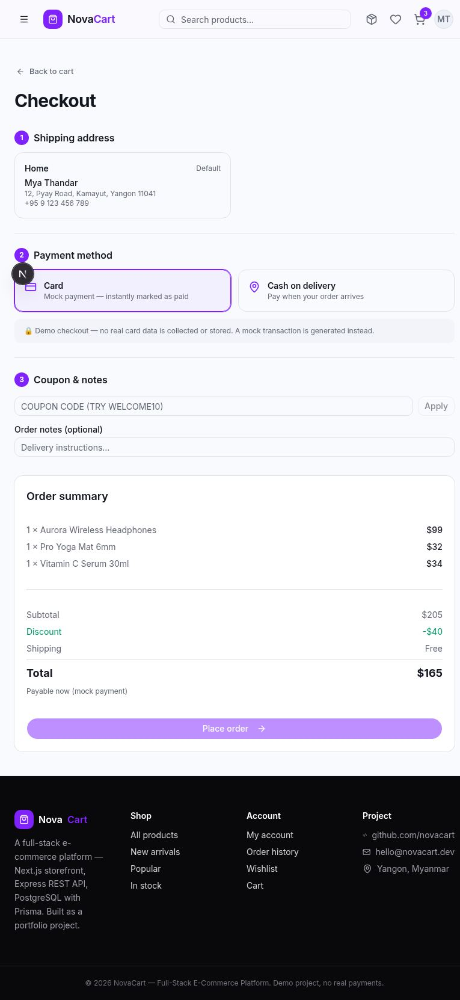
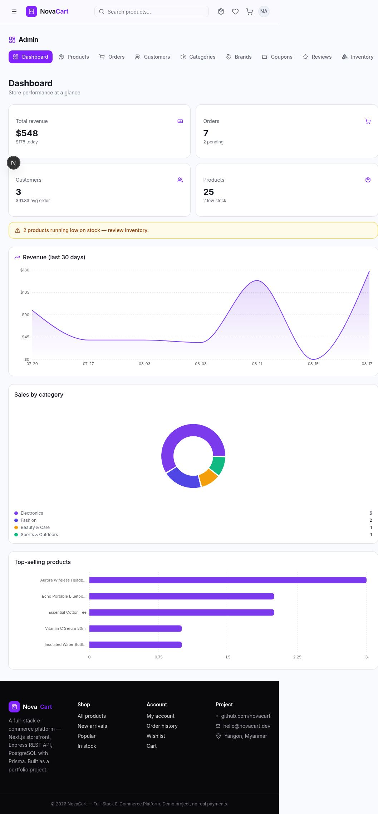
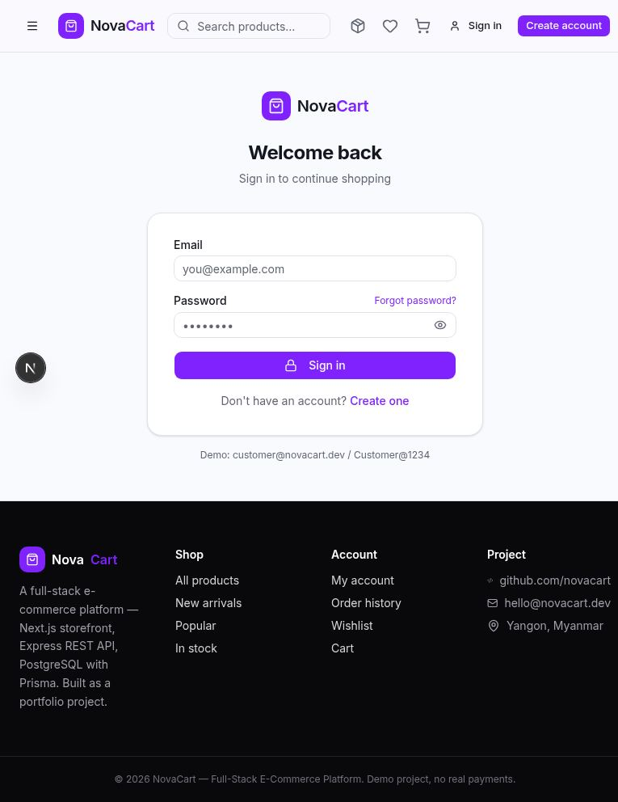

# 🛍️ NovaCart — Full-Stack E-Commerce Platform

A production-quality full-stack e-commerce platform built as a portfolio project.
A modern Next.js storefront talks to a clean, layered Express + TypeScript REST
API backed by PostgreSQL (Prisma ORM), with JWT authentication, role-based
authorization, real business logic (checkout, coupons, inventory, order state
machine), 80+ backend integration tests, a generated Postman collection and an
analytics-driven admin dashboard.

> **Demo only** — payments use a realistic **mock payment flow**. No real card
> data is ever collected or stored.

---

## ✨ Features

| Area | What you get |
| --- | --- |
| **Storefront** | Home (hero, featured, new arrivals, popular), product listing with search / filters / sorting / pagination, product details with variants, ratings & reviews |
| **Accounts** | Register, login, logout, refresh-token rotation, forgot/reset password (mock email in dev), profile & settings |
| **Shopping** | Server-validated cart, wishlist, addresses, multi-step checkout with coupons and mock payments, order history + tracking timeline |
| **Reviews** | Only verified purchasers flagged, one review per product per user, rating auto-recalculation |
| **Admin** | Dashboard with revenue/order analytics & charts, full CRUD for products, categories, brands, coupons, orders, users, reviews and inventory (with audit logs) |
| **Security** | bcrypt password hashing, JWT access + rotating refresh tokens, RBAC, helmet, CORS, rate limiting, Zod validation everywhere, centralized error handling |
| **Quality** | 80 passing integration tests, TypeScript strict mode, ESLint + Prettier, Postman collection, Docker setup |

## 🧰 Tech Stack

**Frontend** — Next.js 16 (App Router) · TypeScript · Tailwind CSS v4 · shadcn/ui · Zustand · SWR · React Hook Form · Zod · Lucide · Recharts

**Backend** — Node.js · Express · TypeScript · REST API · JWT · bcryptjs · Helmet · CORS · express-rate-limit · Zod

**Database** — PostgreSQL · Prisma ORM (19 models, migrations, seed)

**Tooling** — Vitest + Supertest · Postman · ESLint · Prettier · Git · Docker

## 🏗️ Architecture

Clean layered backend — routers → middleware → controllers → services → Prisma → PostgreSQL:

```
Request
   ↓
Router          routes/           URL → handler mapping
   ↓
Middleware      middlewares/      auth (JWT), authorize (RBAC), validation, rate limiting
   ↓
Controller      controllers/      parse request, call service, shape response
   ↓
Service         services/         business rules (prices, stock, coupons, order flow)
   ↓
Prisma ORM      prisma/schema.prisma
   ↓
PostgreSQL
```

```
ecommerce-platform/
├── frontend/            Next.js storefront (App Router)
├── backend/
│   ├── src/
│   │   ├── config/      env validation, Prisma client
│   │   ├── controllers/ thin HTTP layer
│   │   ├── services/    business logic (the source of truth)
│   │   ├── routes/      REST endpoints under /api/v1
│   │   ├── middlewares/ auth, RBAC, validation, errors, rate limiting
│   │   ├── validators/  Zod schemas
│   │   ├── utils/       ApiError, tokens, pagination, serializers
│   │   └── app.ts, server.ts
│   ├── prisma/          schema, migrations, seed
│   ├── tests/           80 integration tests (Vitest + Supertest)
│   ├── postman/         exported collection + environment
│   └── scripts/         Postman collection generator
├── docs/                API reference + screenshots
├── docker-compose.yml   PostgreSQL + backend + frontend
└── README.md
```

## 🗄️ Database Overview

19 models: `User`, `RefreshToken`, `PasswordResetToken`, `Address`, `Category`,
`Brand`, `Product`, `ProductImage`, `ProductVariant`, `Cart`, `CartItem`,
`Wishlist`, `WishlistItem`, `Order`, `OrderItem`, `Payment`, `Review`, `Coupon`,
`InventoryLog`.

Highlights:

- Orders **snapshot** item names/prices/addresses so history stays stable.
- Money is stored as `Decimal(12,2)`; the server recomputes every total.
- `@@unique` constraints prevent duplicate cart items, wishlist items and reviews.
- `InventoryLog` gives a full audit trail of every stock change.
- Refresh tokens are stored **hashed** and rotated on every refresh.

## 🔐 Authentication Flow

1. `POST /auth/register` or `POST /auth/login` → returns `accessToken` +
   `refreshToken` (also set as an `httpOnly` cookie).
2. The frontend keeps the access token in memory and attaches
   `Authorization: Bearer <token>` to every request.
3. On `401`, the API client transparently calls `POST /auth/refresh`,
   **rotates** the refresh token (old one revoked), and retries the request.
4. `POST /auth/logout` revokes the refresh token server-side.
5. Passwords are hashed with bcrypt (12 rounds) and never stored in plain text.

**Roles:** `CUSTOMER` and `ADMIN`. Admin-only routes are guarded by an
`authorize("ADMIN")` middleware; customers can only ever reach their own
resources (orders, cart, addresses, reviews).

## 🚀 Getting Started

### Prerequisites

- Node.js ≥ 20
- PostgreSQL ≥ 14 (or Docker)
- npm ≥ 10

### 1. Clone & install

```bash
git clone <your-repo-url> ecommerce-platform
cd ecommerce-platform

# Backend
cd backend
cp .env.example .env     # then fill in DATABASE_URL + JWT secrets
npm install

# Frontend
cd ../frontend
cp .env.example .env.local
npm install
```

### 2. Database

```bash
cd backend
npm run db:migrate       # apply Prisma migrations
npm run db:seed          # demo data + demo accounts
```

> 💡 **Product photos** ship with the storefront in `frontend/public/images/`
> (products, categories, brands) and the seed references them via
> `/images/...` paths. Re-run `npm run db:seed` anytime to refresh the demo
> data — product, category and brand images are refreshed (not duplicated) and
> demo orders are deterministic (`NC-DEMO-0001…0006`), so the admin dashboard
> always shows the same baseline numbers.
>
> Notes on the demo data: the **Zen 4K Action Camera is seeded out of stock**
> (and a couple of items low-stock) so the storefront's out-of-stock state is
> visible; no sample **address** is created anymore — add your own from
> *Account → Addresses*.

### Clean up your test data

If you registered an account and played around (orders, cart, wishlist,
addresses, reviews), wipe just that account's data — the account stays:

```bash
# Adjust the name/email in backend/scripts/cleanup.sql first if needed
psql -h localhost -U novacart -d novacart -f backend/scripts/cleanup.sql
```

### 3. Run

```bash
# Terminal 1 — API on http://localhost:4000
cd backend && npm run dev

# Terminal 2 — storefront on http://localhost:3000
cd frontend && npm run dev
```

Open http://localhost:3000. Health check: http://localhost:4000/api/v1/health.

### 🔑 Demo Accounts

| Role | Email | Password |
| --- | --- | --- |
| Admin | `admin@novacart.dev` | `Admin@1234` |
| Customer | `customer@novacart.dev` | `Customer@1234` |

**Demo coupons:** `WELCOME10` (10% off, min $30) · `SAVE15` (15% off, min $50) ·
`FLAT5` ($5 off, min $20).

### Docker (optional)

```bash
docker compose up --build
# API      → http://localhost:4000
# Frontend → http://localhost:3000
# Postgres → localhost:5432 (novacart / novacart / novacart_dev_password)
```

## 🧪 Testing

```bash
cd backend
npm test                 # 80 integration tests against a dedicated test DB
```

Tests cover: auth (register/login/refresh rotation/logout/password reset),
authorization (403s), products (search/filter/sort/hide-unpublished/CRUD),
cart (totals, stock limits, ownership), orders (checkout math, coupon
application, inventory decrement, cancellation + refund, status transitions,
foreign-resource protection), coupons (expiry, usage limits, minimums, caps)
and reviews (verified purchases, duplicates, ownership).

## 📮 Postman

A complete collection ships at `backend/postman/`:

1. Import `ecommerce-api.postman_collection.json` and
   `ecommerce-api.postman_environment.json` into Postman.
2. Run **Auth → Login as Admin** and **Auth → Login** — tokens are captured
   automatically into collection variables.
3. Run **Users → Create Address** and **Products → Create Product (Admin)** to
   populate `ADDRESS_ID` / `PRODUCT_ID` for the cart & checkout flows.

The collection includes positive and negative test scripts (validation errors,
duplicate resources, expired coupons, RBAC checks). Regenerate anytime with
`npm run postman:generate`.

## 📚 API Reference

Full endpoint documentation → [docs/API.md](docs/API.md).

Base URL: `http://localhost:4000/api/v1` — consistent response envelopes:

```json
// Success
{ "success": true, "message": "Products fetched successfully", "data": {} }

// Error
{ "success": false, "message": "Product not found", "errors": [] }
```

### Core endpoints

```
POST   /auth/register            POST   /auth/login
POST   /auth/refresh             POST   /auth/logout
POST   /auth/forgot-password     POST   /auth/reset-password
GET    /auth/me

GET    /products                 GET    /products/:id      (id or slug)
POST   /products  (admin)        PATCH  /products/:id  (admin)
DELETE /products/:id (admin)     GET    /products/admin/list (admin)

GET    /categories               GET    /categories/:id
POST   /categories (admin)       PATCH  /categories/:id (admin)  …

GET    /cart                     POST   /cart/items
PATCH  /cart/items/:id           DELETE /cart/items/:id
DELETE /cart                     GET    /wishlist  …

POST   /orders                   GET    /orders
GET    /orders/:id               PATCH  /orders/:id/cancel
GET    /orders/admin/all (admin) PATCH  /orders/admin/:id/status (admin)

GET    /products/:productId/reviews        POST   /products/:productId/reviews
PATCH  /reviews/:id              DELETE /reviews/:id
GET    /reviews/mine             GET    /reviews/admin/all (admin)

POST   /coupons/validate         GET    /coupons (admin)  …

GET    /admin/stats              GET    /admin/revenue?days=30
GET    /admin/top-products       GET    /admin/sales-by-category
GET    /admin/inventory          PATCH  /admin/inventory/:id
```

## 🖼️ Screenshots

| | |
| --- | --- |
| **Home** |  |
| **Products** |  |
| **Product detail** |  |
| **Cart** |  |
| **Checkout** |  |
| **Admin dashboard** |  |
| **Admin orders** |  |

## 🌍 Deployment

Frontend and backend deploy separately (see [docs/API.md](docs/API.md) for env
requirements):

```
Next.js  → Vercel / any Node host       (NEXT_PUBLIC_API_URL → API)
Express  → Vercel serverless / Render / Railway / a VPS
Postgres → Neon / Supabase / RDS / managed PostgreSQL
```

Production checklist: set `NODE_ENV=production`, real JWT secrets, `CLIENT_URL`,
`COOKIE_SECURE=true`, `DATABASE_URL` of the managed DB, run
`npm run db:deploy`, and `npm run build` in both apps.

### Deploy on Vercel (Services — single project, single domain)

This repo is a monorepo with two apps. Vercel's **Services** feature deploys
both in **one project** on one domain via [`vercel.json`](vercel.json):

- `frontend/` — Next.js storefront at `/`
- `backend/` — Express API at `/api/v1/*` (serverless entry: `backend/api/index.ts`)

Project-level environment variables:

```
DATABASE_URL=postgresql://<user>:<pass>@<host>-pooler.<region>.aws.neon.tech/neondb?sslmode=require&pgbouncer=true
DIRECT_URL=postgresql://<user>:<pass>@<host>.<region>.aws.neon.tech/neondb?sslmode=require
JWT_ACCESS_SECRET=<long-random-string>
JWT_REFRESH_SECRET=<long-random-string>
CLIENT_URL=https://<your-project>.vercel.app
COOKIE_SECURE=true
MOCK_EMAIL=true
NEXT_PUBLIC_API_URL=https://<your-project>.vercel.app/api/v1
```

Database: create a free **Neon** Postgres project and use its **pooled**
connection string for `DATABASE_URL` (the `-pooler` host) with the **direct**
connection string as `DIRECT_URL`. Run migrations + seed once:

```bash
cd backend
DATABASE_URL="<direct-url>" npx prisma migrate deploy
DATABASE_URL="<direct-url>" npm run db:seed
```

## 🧹 Business Rules (server-side, never trusted from the client)

- Prices and totals are always recomputed by the server.
- Stock is validated at add-to-cart **and** at checkout; decrement is
  conditional so stock can never go negative.
- Cancelled orders restore stock and refund paid payments.
- Order status follows a strict state machine (`PENDING → CONFIRMED →
  PROCESSING → SHIPPED → DELIVERED`, cancel only from PENDING/CONFIRMED).
- Coupons are validated against expiry, active flag, usage limits, minimum
  order value and max discount caps.
- Duplicate reviews and duplicate wishlist/cart items are rejected with 409.
- Customers cannot read, modify or cancel another customer's resources.

## 📜 License

MIT — free to use for learning and portfolio purposes.
